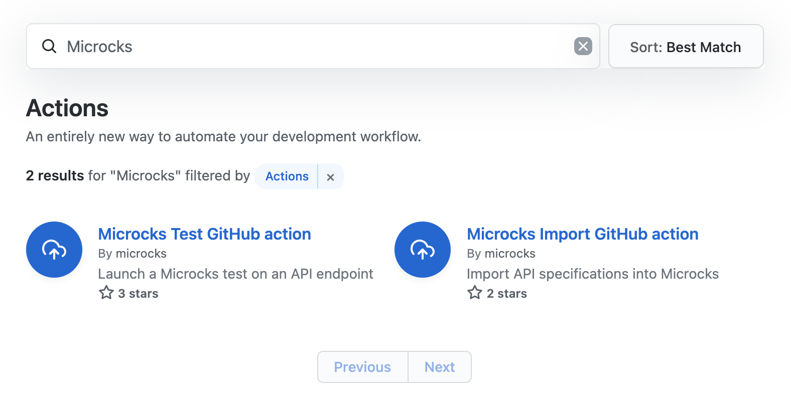

## GitHub Action for importing API spec in Microcks

### What is it?

This is a GitHub Action you may use in your Workflow to import into Microcks some API specification files. This allow keeping your API definitions, mocks and tests up-to-date into Microcks.. This action is basically a wrapper around the [Microcks CLI](https://github.com/microcks/microcks-cli) and provides the same configuration capabilities.

The `import` command of the CLI just need 1 argument:

* `<specificationFile1[:primary],specificationFile2[:primary]>` : Comma separated list of API specs to import with flag telling if it's a primary artifact. Example: `'specs/my-openapi.yaml:true,specs/my-postmancollection.json:false'`

With a bunch of mandatory flags:

* `--microcksURL` for the Microcks API endpoint,
* `--keycloakClientId` for the Keycloak Realm Service Account ClientId,
* `--keycloakClientSecret` for the Keycloak Realm Service Account ClientSecret.

### How to use it?

Obviously we can find this action with [GitHub Actions Marketplace](https://github.com/marketplace?type=actions) :wink:

You may add the Action to your Workflow directly from the GitHub UI.



#### Step 1 - Configure the GitHub action

```yaml
name: my-workflow
on: [push]
jobs:
  my-job:
    runs-on: ubuntu-latest
    environment: Development
    steps:
      - uses: microcks/import-github-action@v1
        with:
          specificationFiles: 'samples/weather-forecast-openapi.yml:true,samples/weather-forecast-postman.json:false'
          microcksURL: 'https://microcks.apps.acme.com/api/'
          keycloakClientId:  ${{ secrets.MICROCKS_SERVICE_ACCOUNT }}
          keycloakClientSecret:  ${{ secrets.MICROCKS_SERVICE_ACCOUNT_CREDENTIALS }}
```

#### Step 2 - Configure the Secrets

As you probably saw just above, we do think it's a best practice to use GitHub Secrets (general or tied to `Environment` like in the example) to hold the Keycloak credentials (client Id and Secret). See below the Secrets configuration we've used for the example:

